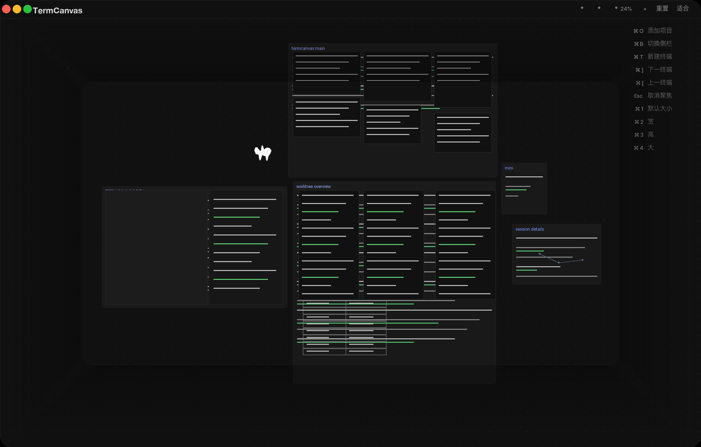

<div align="center">


# TermCanvas

**你的终端，铺在无限画布上。**

[](https://github.com/blueberrycongee/termcanvas/releases)
[](LICENSE)
[]()



</div>

[English](./README.md)

## 应用图标

仓库现在包含一套可直接用于发布的应用图标，基于 TermCanvas 的核心标记整理而成。打包时会直接使用：

- `build/icon.icns` 用于 macOS
- `build/icon.ico` 用于 Windows
- `build/icon.png` 用于 Linux 和通用品牌展示

可编辑源文件位于 `build/icon.svg`。

## 什么是 TermCanvas

TermCanvas 把你所有的终端铺在一张无限空间画布上——不再有标签页，不再有分屏。自由拖拽、放大聚焦、缩小俯瞰，还能用手绘工具做标注。

它以 **Project → Worktree → Terminal** 三层结构来组织一切，和你使用 git 的方式完全一致。添加一个项目，TermCanvas 自动检测它的 worktree；在终端里新建一个 worktree，画布上立刻出现。

## 功能特性

**核心能力**
- 无限画布——自由平移、缩放、排列终端
- 三层层级——项目包含 worktree，worktree 包含终端
- 实时 worktree 检测——新建 worktree 自动出现
- 绘图工具——画笔、文字、矩形、箭头标注

**AI 集成**
- Claude Code 终端，带会话状态指示
- Codex 终端支持
- AI diff 审查卡片

## 快速开始

**下载** —— 从 [GitHub Releases](https://github.com/blueberrycongee/termcanvas/releases) 获取最新构建。

**从源码构建：**

```bash
git clone https://github.com/blueberrycongee/termcanvas.git
cd termcanvas
npm install
npm run dev
```

## 快捷键

| 快捷键 | 功能 |
|--------|------|
| `⌘ O` | 添加项目 |
| `⌘ B` | 切换侧边栏 |
| `⌘ T` | 新建终端 |
| `⌘ ]` | 下一个终端 |
| `⌘ [` | 上一个终端 |
| `Esc` | 取消聚焦 / 恢复上次聚焦 |
| `⌘ 1` | 终端尺寸：默认 |
| `⌘ 2` | 终端尺寸：宽 |
| `⌘ 3` | 终端尺寸：高 |
| `⌘ 4` | 终端尺寸：大 |

> Windows/Linux 上用 `Ctrl` 替换 `⌘`。

## 技术栈

| 层级 | 技术 |
|------|-----|
| 桌面框架 | Electron 41 |
| 前端 | React 19, TypeScript |
| 终端 | xterm.js 6, node-pty |
| 状态管理 | Zustand 5 |
| 样式 | Tailwind CSS 4, Geist 字体 |
| 绘图 | perfect-freehand |
| 构建 | Vite 7 |

## 参与贡献 & 许可证

欢迎贡献——Fork、创建分支、发起 PR。基于 [MIT](LICENSE) 许可。
